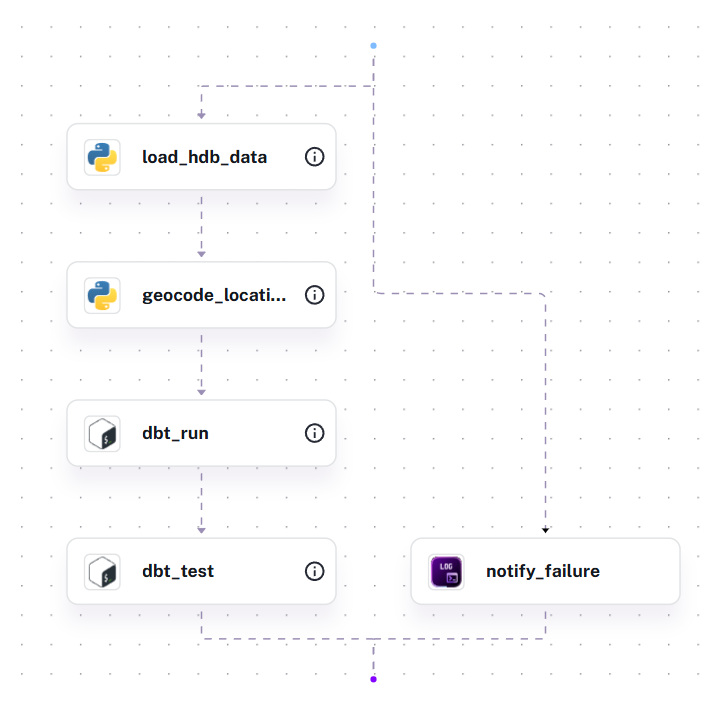
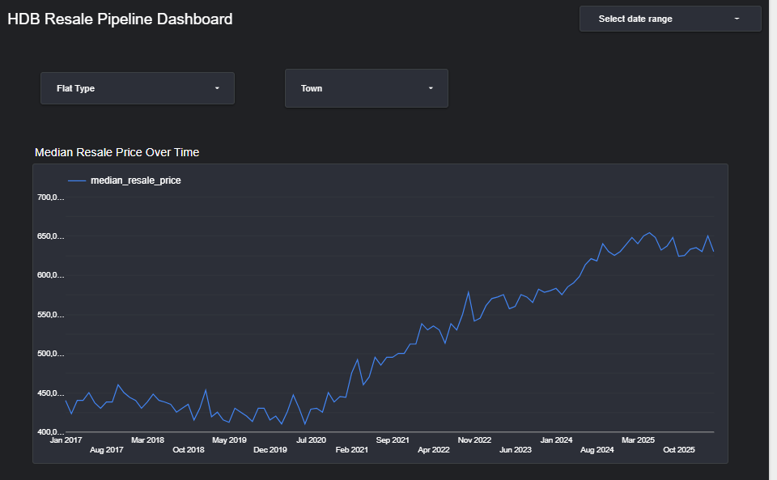
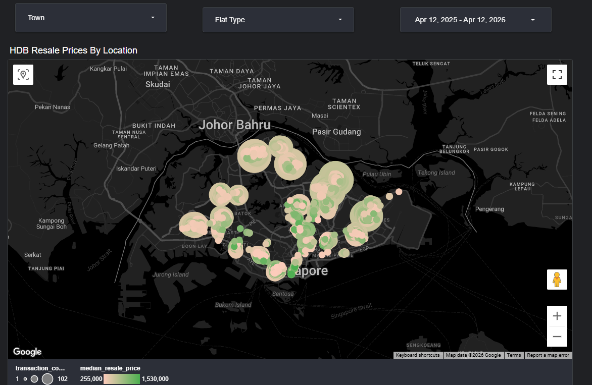

# HDB Resale Flat Prices Analytics Pipeline


**Data Engineering Zoomcamp 2026 Capstone Project**

---

## Status

- [x] GCP infrastructure provisioned via Terraform
- [x] HDB resale data ingested from data.gov.sg API → GCS + BigQuery (`raw_hdb.hdb_resale`, 228,542 rows)
- [x] Street geocoding via OneMap API → BigQuery (`raw_hdb.hdb_locations`, 577 streets)
- [x] dbt staging models: `stg_hdb_prices`, `stg_locations`
- [x] dbt mart models: `mart_hdb_by_month`, `mart_affordability_index`, `mart_price_trends`
- [x] 24 dbt tests passing across staging and mart layers
- [x] Looker Studio dashboard
- [x] Kestra orchestration flow

---

## Problem Statement

Singapore's public housing (HDB) resale market is one of the most active in the world, yet understanding affordability trends and market dynamics across towns and flat types requires piecing together fragmented data. Buyers, analysts, and policymakers lack a single, up-to-date analytical view of how resale prices have evolved — by town, room type, and time period.

This project builds an end-to-end data pipeline to answer:

- How have HDB resale prices evolved over time by town and flat type?
- What market segments exist across price ranges, room types, and affordability levels?
- Which towns show the highest growth and remain most affordable?

---

## Overview

This project ingests historical HDB resale flat price data from the [data.gov.sg API](https://data.gov.sg/collections/189/view) and enriches it with geographic coordinates via the OneMap API. The pipeline loads raw data into Google Cloud Storage, transforms it through dbt models in BigQuery, and surfaces insights via a Looker Studio dashboard.

Orchestration is handled by Kestra, with infrastructure provisioned via Terraform on GCP.

---

## Table of Contents

- [Tech Stack](#tech-stack)
- [Architecture](#architecture)
- [Project Structure](#project-structure)
- [Data Source Overview](#data-source-overview)
- [Data Pipeline](#data-pipeline)
- [Data Quality & Testing](#data-quality--testing)
- [Dashboard](#dashboard)
- [Steps to Reproduce](#steps-to-reproduce)
- [Known Limitations & Future Work](#known-limitations--future-work)
- [Resources](#resources)
- [Author](#author)

---

## Tech Stack

| Component | Technology |
|-----------|-----------|
| **Cloud Platform** | Google Cloud Platform (GCP) |
| **Infrastructure as Code** | Terraform |
| **Data Lake** | Google Cloud Storage (GCS) |
| **Data Warehouse** | BigQuery |
| **Ingestion** | Python 3.13+ |
| **Transformation** | dbt-fusion 2.0.0 (preview) + BigQuery SQL |
| **Orchestration** | Kestra |
| **Visualization** | Looker Studio |
| **Package Manager** | uv |

---

## Architecture


```text
data.gov.sg API (HDB resale data)
    ↓
Python Ingestion (hdb_loader.py)
    ↓
GCS Raw Layer (gs://de-zoomcamp-hdb-resale-hdb-raw/)
    ↓
OneMap API Geocoding (location_enricher.py)
    ↓
BigQuery raw_hdb (hdb_resale + hdb_locations)
    ↓
dbt Transformation (staging → marts)
    ↓
BigQuery dbt_sthyagaraj_marts
    ↓
Looker Studio Dashboard
```

Orchestration via Kestra manages the pipeline end-to-end.

---

## Project Structure

```text
hdb-resale-pipeline/
├── README.md
├── pyproject.toml            # uv project config
├── uv.lock                   # pinned dependencies
├── .env.example              # environment variable template
├── .gitignore
│
├── terraform/                # GCP infrastructure
│   ├── main.tf
│   ├── variables.tf
│   └── outputs.tf
│
├── src/ingestion/            # Python ingestion scripts
│   ├── hdb_loader.py         # Fetch from data.gov.sg API → GCS + BigQuery
│   ├── location_enricher.py  # Geocode street names via OneMap API
│   ├── config.py             # Shared configuration and env vars
│   └── test_api_key.py       # Smoke test for data.gov.sg API key
│
├── dbt/                      # Data transformation
│   ├── dbt_project.yml
│   ├── profiles.yml
│   └── models/
│       ├── staging/
│       │   ├── sources.yml
│       │   ├── schema.yml
│       │   ├── stg_hdb_prices.sql
│       │   └── stg_locations.sql
│       └── marts/
│           ├── schema.yml
│           ├── mart_hdb_by_month.sql
│           ├── mart_affordability_index.sql
│           └── mart_price_trends.sql
│
└── kestra/flows/                  # Orchestration flows
    └── hdb_pipeline_flow.yml      # Full pipeline load
```

---

## Data Source Overview

[data.gov.sg](https://data.gov.sg/collections/189/view) provides historical HDB resale flat transaction records updated monthly via a REST API. The dataset includes town, flat type, storey range, floor area, resale price, and lease commencement date going back to 1990 (228,542 records).

Geographic enrichment is done via the [OneMap API](https://www.onemap.gov.sg/apidocs/) — Singapore's official geocoding service — which maps 577 unique street names to latitude/longitude coordinates.

---

## Data Pipeline

### 1. Data Extraction

- `hdb_loader.py` fetches the full HDB resale dataset via the data.gov.sg API
- Raw CSV uploaded to GCS (`hdb_resale/`) and loaded into BigQuery (`raw_hdb.hdb_resale`)
- All columns stored as strings in the raw layer — no type casting at this stage

### 2. Location Enrichment

- `location_enricher.py` calls the OneMap API for each unique street name (577 streets)
- Geocoded lookup table loaded into BigQuery (`raw_hdb.hdb_locations`)
- Enriched CSV (with lat/long) written back to GCS (`hdb_enriched/`)

### 3. Data Transformation (dbt)

| Layer | Model | Description |
| ----- | ----- | ----------- |
| Staging | `stg_hdb_prices` | Type casting (STRING → DATE/FLOAT/INT), whitespace trimming |
| Staging | `stg_locations` | Filtered to `geocode_status = OK` |
| Marts | `mart_hdb_by_month` | Monthly median price, count, price/sqm by town & flat type |
| Marts | `mart_affordability_index` | Affordability metrics by town (last 24 months) |
| Marts | `mart_price_trends` | Quarter-over-quarter price evolution by town & flat type |

### 4. Orchestration (Kestra)

A single flow manages the pipeline end-to-end via Kestra, running in Docker locally:

| Flow | File | Purpose |
| ---- | ---- | ------- |
| `hdb_pipeline` | `kestra/flows/hdb_pipeline_flow.yml` | Full load: fetch → geocode → dbt run → dbt test |

The flow is **self-contained** — Python scripts and dbt models are embedded inline via `inputFiles`. No namespace file uploads or Docker volume mounts required. All credentials are stored in the Kestra KV store.



### 5. Visualization

Looker Studio dashboard connects to `dbt_sthyagaraj_marts` in BigQuery and presents:

- **Price Trends** — median resale price over time by town and flat type
- **Affordability Index** — price per sqm comparison across towns
- **Price Heatmap** — geographic scatter plot coloured by resale price
- **QoQ Trends** — quarter-over-quarter price change

Filters: town, flat type, date range

---

## Data Quality & Testing

- **dbt schema tests:** `not_null` on all key columns, `unique` on `street_name`, `accepted_values` on `flat_type`
- **24 tests passing** across staging and mart layers
- **Granularity validated:** one row per `month + town + flat_type` in `mart_hdb_by_month`

```bash
cd dbt
dbt test --profiles-dir .
```

---

## Dashboard

[View Looker Studio Dashboard](https://lookerstudio.google.com/reporting/91a37d80-d099-4b13-b210-352725f59a3a)

Connects to BigQuery dataset `dbt_sthyagaraj_marts`.





---

## Steps to Reproduce

### Prerequisites

- GCP account with billing enabled
- `gcloud` CLI installed and authenticated
- Python 3.13+
- `uv` — [install guide](https://docs.astral.sh/uv/getting-started/installation/)
- Terraform >= 1.0
- dbt-fusion — [install guide](https://github.com/dbt-labs/dbt-fusion)
- data.gov.sg API key — [sign up](https://data.gov.sg/developers)
- OneMap account — [register](https://www.onemap.gov.sg/apidocs/)
- Git

### 1. Clone & Configure Environment

```bash
git clone <repo-url>
cd hdb-resale-pipeline
cp .env.example .env
```

Edit `.env` and fill in the following:

| Variable | Description |
| --- | --- |
| `GCP_PROJECT_ID` | Your GCP project ID |
| `GCP_REGION` | e.g. `asia-southeast1` |
| `GCP_SERVICE_ACCOUNT_KEY_PATH` | Path to SA key, e.g. `./credentials/hdb-pipeline-sa.json` |
| `BQ_DATASET_RAW` | `raw_hdb` |
| `BQ_DATASET_DBT` | `dbt_sthyagaraj` |
| `GCS_BUCKET_RAW` | Your GCS bucket name from Terraform output |
| `DATA_GOV_SG_API_KEY` | From data.gov.sg developer portal |
| `ONEMAP_EMAIL` | Your OneMap account email |
| `ONEMAP_PASSWORD` | Your OneMap account password |

### 2. Install Dependencies

```bash
# Install Python dependencies
uv sync

# Install dbt-fusion separately (not a Python package)
# Follow: https://github.com/dbt-labs/dbt-fusion
# Verify: dbt --version
```

### 3. Create GCP Project & Enable APIs

```bash
export GCP_PROJECT_ID="your-project-id"
gcloud projects create $GCP_PROJECT_ID
gcloud config set project $GCP_PROJECT_ID

gcloud services enable bigquery.googleapis.com
gcloud services enable storage-api.googleapis.com
gcloud services enable logging.googleapis.com
```

### 4. Deploy Infrastructure (Terraform)

```bash
gcloud auth application-default login

cd terraform
terraform init
terraform plan
terraform apply

# Save the service account key
mkdir -p ../credentials
terraform output -raw service_account_key_private | base64 --decode > ../credentials/hdb-pipeline-sa.json
cd ..
```

> Store `credentials/hdb-pipeline-sa.json` securely — never commit it.

### 5. Run Data Ingestion

```bash
# Fetch HDB resale data from data.gov.sg API → GCS + BigQuery
uv run python src/ingestion/hdb_loader.py --backfill

# Geocode street names via OneMap API → GCS + BigQuery
# Replace <bucket> with your GCS_BUCKET_RAW value and <date> with today's date (YYYYMMDD)
uv run python src/ingestion/location_enricher.py \
    --input gs://<bucket>/hdb_resale/hdb_resale_<date>.csv
```

### 6. Run dbt Transformations

> This project uses **dbt-fusion** (Rust-based dbt engine). Ensure `dbt` is available on your PATH.

```bash
cd dbt
dbt debug --profiles-dir .       # verify BigQuery connection
dbt run --profiles-dir .         # builds 5 models across 2 datasets:
                                 #   dbt_sthyagaraj_staging (stg_hdb_prices, stg_locations)
                                 #   dbt_sthyagaraj_marts   (mart_hdb_by_month, mart_affordability_index, mart_price_trends)
dbt test --profiles-dir .        # run 24 tests
cd ..
```

### 7. Setup Kestra Orchestration

**Start Kestra:**

```bash
docker-compose up -d
```

Kestra UI will be available at [http://localhost:8080](http://localhost:8080).

**Configure credentials:**

All credentials are stored in the Kestra KV store (not as files or env vars). In the Kestra UI, navigate to **Namespaces** → `hdb_resale` → **KV Store** and add entries for GCP project details, GCS bucket, BigQuery dataset, API keys, and the full GCP service account JSON. See `.env.example` for the full list of required values.

**Load and run the pipeline flow:**

1. Go to **Flows** → **Create**
2. Paste the contents of `kestra/flows/hdb_pipeline_flow.yml`
3. Save, then click **Execute**

The flow runs 4 tasks in sequence: `load_hdb_data` → `geocode_locations` → `dbt_run` → `dbt_test`.

### 8. View Dashboard

Open the [Looker Studio Dashboard](https://lookerstudio.google.com/reporting/91a37d80-d099-4b13-b210-352725f59a3a) — or connect your own Looker Studio report to BigQuery dataset `dbt_sthyagaraj_marts`.

---

## Known Limitations & Future Work

- **Proximity enrichment**: MRT/school proximity data deferred to Phase 2
- **Incremental load**: Current pipeline does a full reload on every run (`WRITE_TRUNCATE`). A future improvement would add a scheduled incremental flow that fetches only new monthly records from data.gov.sg, deduplicates against existing BigQuery data, and geocodes only new streets — reducing runtime and API cost
- **Forecasting**: Price prediction/ML models not in MVP scope

---

## Resources

- [data.gov.sg HDB Resale Data](https://data.gov.sg/collections/189/view)
- [OneMap API Documentation](https://www.onemap.gov.sg/apidocs/)
- [dbt-fusion](https://github.com/dbt-labs/dbt-fusion)
- [Kestra Documentation](https://kestra.io/)
- [BigQuery Best Practices](https://cloud.google.com/bigquery/docs/best-practices)
- [uv Documentation](https://docs.astral.sh/uv/)

---

## Author

Sudharsan
